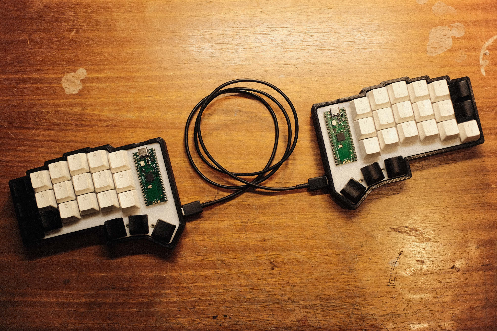

# splitrey
Handwired, split, column stagger mechanical keyboard.

## Material List
- 2x RP2040
- 42x 1N4148
- 42x MX Switches
- 12x M2x12mm Screws
- 12x M2 Hex nuts 
- 4x [20 pin female connectors](https://pt.aliexpress.com/item/4001198421663.html)
- 2x [USB-C Female connectors](https://pt.aliexpress.com/item/1005005708781461.html)
- 160g of PLA filament (roughly)
- USB-C to USB-C cable
- Keycaps
